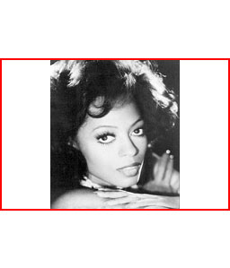
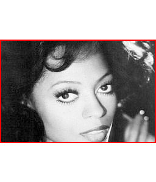

# Ver-ID Image Capture JS

The library captures images from mobile device cameras. On desktop browsers it displays a QR code with a link to use on mobiles.

## Installation

In your HTML file include:

```html
<script type="text/javascript" src="https://cdn.jsdelivr.net/gh/englishextra/qrjs2@0.1.7/js/qrjs2.min.js"></script>
```

## Usage example

```javascript
// Import capture function
import captureImage from "https://cdn.jsdelivr.net/gh/AppliedRecognition/Ver-ID-Image-Capture-JS@3.0.0/dist/imageCapture.min.js"

// Create a button
var button = document.createElement("a")
button.href = "javascript:void(0)"
// Attach a click listener
button.onclick = function() {
    var options = {
        "useFrontCamera": true,
        "size": {
            "width": 600,
            "height": 400
        },
        "scaling": "fill"
    }
    // Capture the image
    captureImage().then(function(imageDataURL) {
        // Display the captured image
        var img = document.createElement("img")
        img.src = imageDataURL
        document.body.appendChild(img)
    }).catch(function(error) {
        alert("Capture failed")
    })
}
button.innerText = "Capture image"
document.body.appendChild(button)

// Import QR code generator function
import generateQRCode from "https://cdn.jsdelivr.net/gh/AppliedRecognition/Ver-ID-Image-Capture-JS@3.0.0/dist/qrCodeGenerator.min.js"

// Generate a QR code with the page URL to direct the user to an alternative device
generateQRCode(location.href).then(function(qrCode) {
    // Display the QR code in an image
    var img = document.createElement("img")
    img.src = qrCode
    document.body.appendChild(img)
}).catch()
```

## Capture options
All settings are optional.

### useFrontCamera (boolean)
Set to `true` to use the camera on the front of the device (facing the user). Set to `false` to use the camera on the back of the device (facing the environment).

### size (object)
Specify the size to which the captured image should be resized. If no size is specified the image will be left as it was captured by the camera.

### size.width (number)
Scale the image to match the given width.

### size.height (number)
Scale the image to match the given height.

### scaling (string)
Only applicable if both `size.width` and `size.height` are specified. Otherwise it's ignored.

Possible values (red rectangle denotes specified width and height):

- **fit** (default) – scale the image to fit into the given size preserving the image's aspect ratio<br />
 
- **fill** – scale the image to fill the given size preserving the image's aspect ratio<br />
 
- **stretch** - scale the image to stretch into the given size<br />
 

*Image [Motown Records](https://commons.wikimedia.org/wiki/File:Diana_Ross_1976.jpg), Public domain, via Wikimedia Commons*

## Example capture options

```javascript
{
    "useFrontCamera": true, // capture a selfie
    "size": { // scale the image to 300 x 300 pixels
        "width": 300,
        "height": 300
    },
    "scaling": "fill" // crop the image to fill the 300 x 300 pixel rectangle
}
```

## Demo
[Browser demo](https://appliedrecognition.github.io/Ver-ID-Image-Capture-JS/sample.html)

## Building from source (optional)

Steps to build the library from source:

1. [Install NPM and Node JS](https://www.npmjs.com/get-npm)
2. Open the [build](./build) folder in a shell
3. Enter `npm install`
4. Enter `npm run-script build`
5. The minified version of the scripts will be available in the [dist/](./dist/) directory